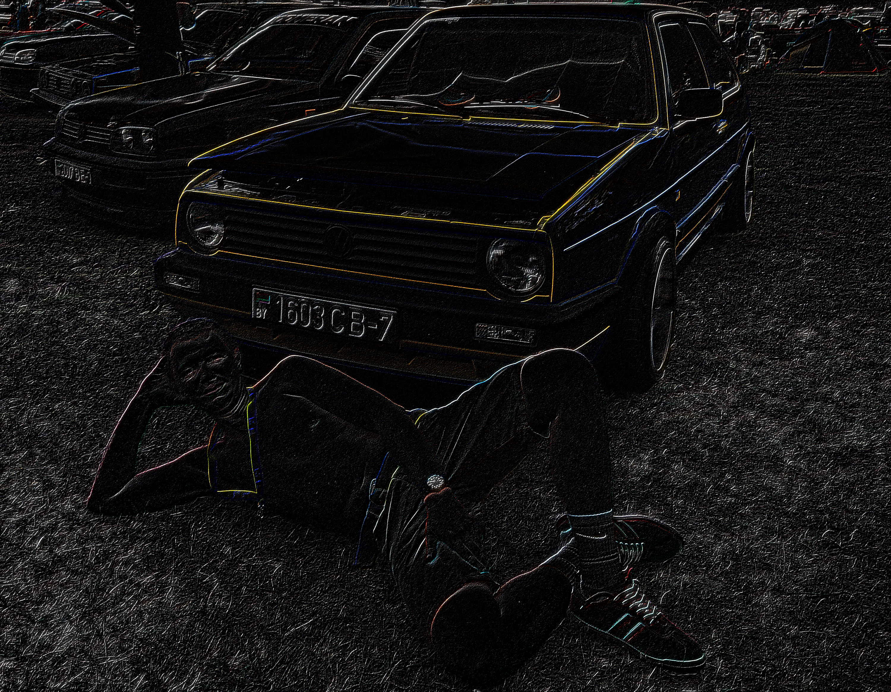
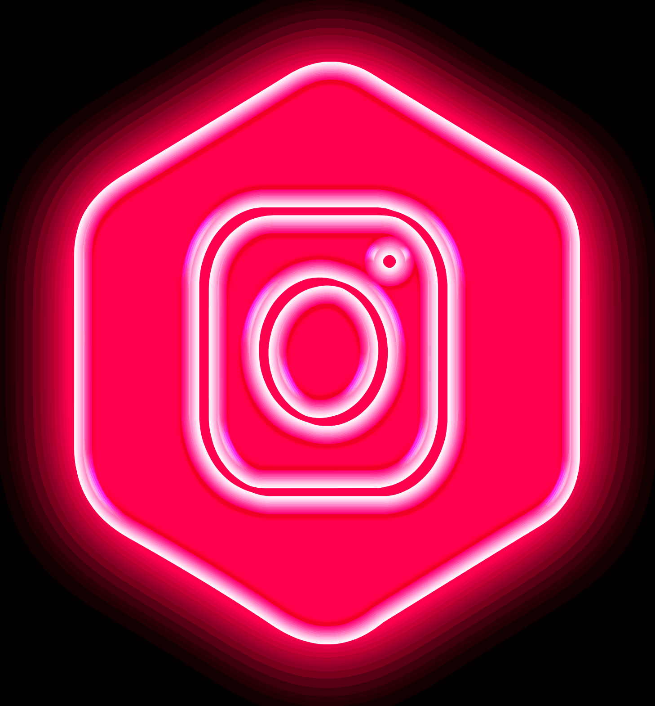

https://user-images.githubusercontent.com/78309054/175772849-11fece26-aa41-4584-aacf-542799169adf.mov

<h2>Languages and Tools:</h2>

      
      
      
      
      
      
       
      
      
      
      

# Contact Me :
 

# If you want to reach out to me about anything, be it some doubt or just to hangout and talk, ping me 😉

 

 
 
 

